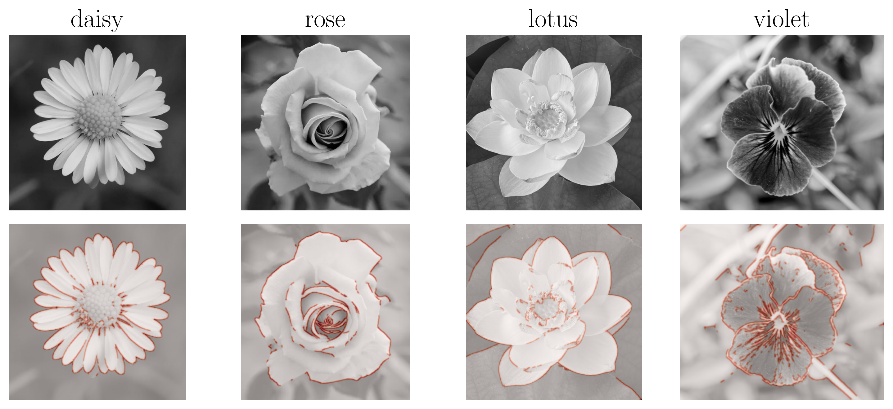

# canny-edge-detection
 
|               |
| :-------------------------------------------: |
| *Personal implementation of Canny's operator* |

 Python implementation (coded entirely in numpy) of the ["A Computational Approach to Edge Detection"](https://ieeexplore.ieee.org/document/4767851) (1986) - Canny's operator for edge detection from digital images.

The algorithm takes a grayscale image as input, parameters pertaining to convolutional kernels (Gaussian standard deviation and width), and hysteresis thresholds. It then output a binary image corresponding to object edges in the image. They are defined as local maxima of gradient magnitudes in the image.

In the Jupyter Notebook, I demonstrate the performance of my implementation on pictures of four flower species.

While this was done for learning purposes, it might be useful for those trying to build an intuition about the method (and convolutional kernels/operations, in general).

## Contents
---------------
```canny_operator.py```: Python implementation of the algorithm.

```demo.ipynb```: Demonstration.